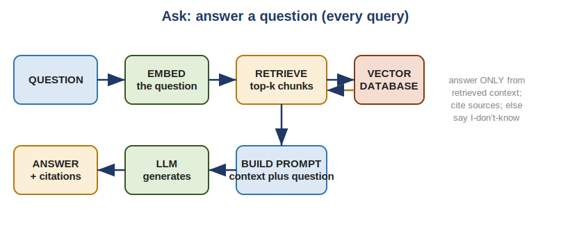
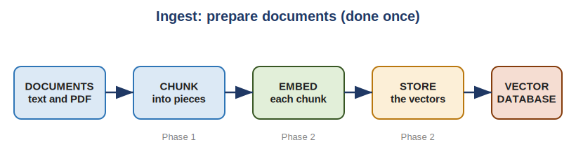
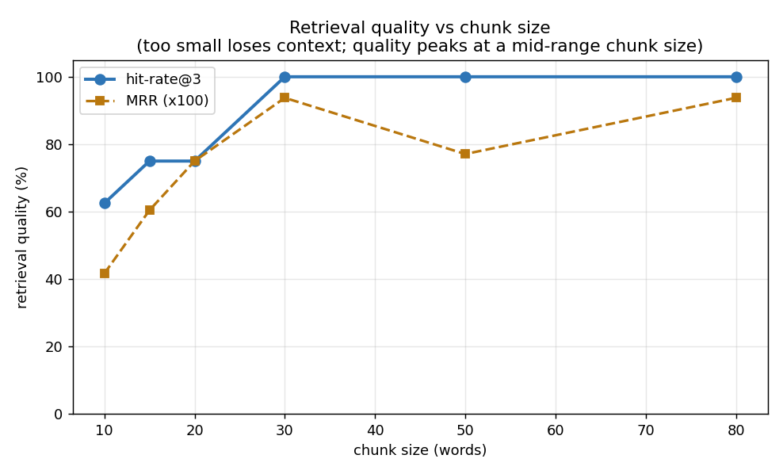

# Semantic Search + RAG Service

A retrieval-augmented generation (RAG) service in Python. You ingest documents;
it answers plain-English questions about them by **retrieving the most relevant
passages and having a language model answer from those** — with **citations**,
and a truthful "I don't know" when the documents don't cover the question.

Built in five phases, each independently runnable and tested.



*Every question: embed it, retrieve the nearest chunks, build a grounded prompt,
generate a cited answer — or refuse when the context doesn't support one.*

## What it does

- **Semantic search** — finds relevant text by *meaning*, not keywords, so
  "reset my password" matches "forgot my login credentials."
- **Grounded answers with citations** — the LLM answers using only retrieved
  context and reports which source chunks it used, so answers are verifiable.
- **Refuses instead of hallucinating** — when the documents don't contain the
  answer, it says so rather than inventing one.
- **An HTTP API** — `/ingest` to add documents, `/ask` to query them.
- **Measured, not assumed** — retrieval quality is evaluated with hit-rate@k
  and MRR, and charted against chunk size.

## Architecture

**Ingest (once per document):**



Documents → chunks → embeddings → vector database.

**Ask (every question):** embed the question → retrieve top-k chunks →
grounded prompt → LLM → cited answer (see the flow at the top).

## Phases

| Phase | Adds | Key idea |
|-------|------|----------|
| **1** | ingest & chunk | overlapping chunks with metadata, no words lost |
| **2** | embed & store | semantic search via a pluggable embedder + Chroma |
| **3** | retrieve & generate | citations + graceful "I don't know" |
| **4** | HTTP service | `/ingest` and `/ask` over the network |
| **5** | evaluation | hit-rate@k, MRR, and the chunk-size chart |

Each phase has its own README (README_rag_phase1.md ... README_rag_phase5.md) with the details.

## Quick start

```bash
pip install -r requirements.txt

# run the service
uvicorn rag_service:app --port 8000

# ingest a document
curl -X POST localhost:8000/ingest -H 'content-type: application/json' \
  -d '{"documents":[{"text":"The capital of France is Paris.","source":"geo"}]}'

# ask — grounded, cited answer
curl -X POST localhost:8000/ask -H 'content-type: application/json' \
  -d '{"question":"What is the capital of France?"}'
# {"answer":"The capital of France is Paris.","grounded":true,
#  "sources":[{"source":"geo","index":0,"score":0.41}]}

# ask something not in the docs — honest refusal
curl -X POST localhost:8000/ask -H 'content-type: application/json' \
  -d '{"question":"boiling point of mercury?"}'
# {"answer":"I don't know based on the provided documents.","grounded":false,"sources":[]}
```

## Pluggable models (develop light, run real)

Both the **embedder** and the **LLM** sit behind small interfaces, so the whole
pipeline runs and is fully testable with dependency-free stand-ins, then swaps
to real models with one line each:

- **Embedder:** `HashingEmbedder` (dep-free) → `SentenceTransformerEmbedder` on Colab
- **LLM:** `ExtractiveLLM` (dep-free, deterministic) → `OpenAILLM` on Colab

Everything else — storage, search, the RAG loop, the HTTP API, the tests — is
identical regardless of which models are plugged in. This kept the project
buildable on a tablet and the trust-logic testable without an API key.

## Evaluation (Phase 5)

```bash
python eval_phase5.py
```
Measures **hit-rate@k** (did the right chunk make the top-k?) and **MRR** (how
high did it rank?) over an eval set, and charts how chunk size affects quality.
The result shows a sweet spot around 30 words for the sample corpus — found by
measuring, not guessing.



## Tests

Every phase ships tests.

```bash
python test_rag_phase1.py    # chunking (no deps)
python test_rag_phase2.py    # embed/store/search
python test_rag_phase3.py    # the RAG loop: grounding, citations, refusal
python test_rag_phase4.py    # the HTTP service
python test_rag_phase5.py    # the evaluation logic
```

Highlights: the refusal path (no hallucination) is tested directly, and several
behaviour-checking tests caught real state-isolation bugs during development.

## Tech stack

- Python
- `sentence-transformers` (or any embeddings API) — embeddings
- `chromadb` — the vector database
- an LLM API (or a small open model) — answer generation
- `FastAPI` + `uvicorn` — the HTTP service (reused from the rate limiter)
- `pypdf` — PDF ingest (reused from the Document Authenticity Checker)
- `matplotlib` — the evaluation chart

## A note on origins

This is the natural companion to a Document Authenticity Checker: once you can
verify documents, you make them **searchable and answerable**. It reuses the
FastAPI service skeleton from a [rate limiter
service](https://github.com/NitishaB4042/rate-limiter-service) and the PDF reading
from the authenticity checker.

## License

MIT (or your choice).
